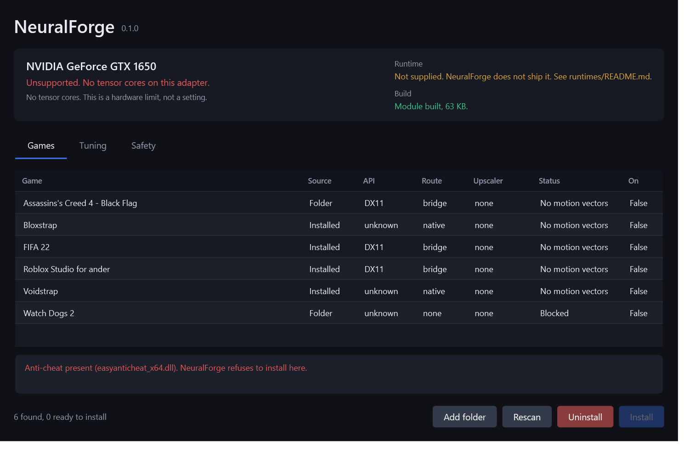

<div align="center">

# NeuralForge

A unified runtime for DLSS 5 neural rendering.
Render-resolution cost, without giving up temporal stability.


</div>



---

## What this is

DLSS 5 is a 148M-parameter one-step diffusion model that runs as a final stage
over an already-rendered frame, adding photoreal lighting and materials. It is
expensive, and it ships gated to the newest hardware.

Half a dozen community forks each solved part of that and fragmented the rest.
NeuralForge is one clean architecture, one config, one installer, every GPU that
can actually run it, plus one idea none of the existing approaches use.

## The idea

The usual way to make this affordable is to run the network at render resolution
and feed its output into the upscaler. That is cheap, and it shimmers. A temporal
upscaler reconstructs detail by accumulating jittered samples of a scene it
assumes is stable, and the output of a generative model is not a jittered sample
of anything. The history clamp rejects it.

NeuralForge takes the cheap evaluation and never hands the result to the
upscaler:

```
game colour ──┬──────────────► SR ──► SR output ──┐
              ▼                                   │
        NR @ render×scale                         ▼
              └─► residual = what changed ──► composite ──► final
```

Super resolution runs on the original buffer, so temporal stability is the same
as in the unmodified game. The generative signal arrives afterwards, at output
resolution, as a modulation.

The residual is stored as a log₂ ratio rather than a difference. That makes it
transfer correctly between resolutions, makes intensity linear in stops, makes
zero an exact no-op, and puts its low and high frequency bands exactly on the
runtime's own Tone and Structure controls.

Every degraded path converges on `residual = 0`, which composites to the
original frame. A failed reprojection, a disocclusion, a dropped evaluation or a
backend error all fade toward the game as it rendered, never toward garbage.

Full reasoning in [docs/ARCHITECTURE.md](docs/ARCHITECTURE.md).

---

## Install

Download the release, extract it, and run `NeuralForge.bat`.

Setup detects your GPU and scans Steam, Epic, GOG, your installed programs and
your game folders. Each game shows its real graphics API, read from the
executable's import table rather than guessed, along with which upscaler it
ships and which route it would take:

| Status | Meaning |
|---|---|
| Ready | DirectX 12 with an upscaler. Native path |
| Ready via bridge | DirectX 11 with an upscaler. Private D3D12 device, roughly 10 percent on top |
| No motion vectors | No upscaler to intercept. Needs optical flow, which is measurably worse |
| Unsupported API | Vulkan or DirectX 9 |
| Blocked | Anti-cheat present. Setup refuses |

Pick a game, set Structure, Tone and the frame budget on the Tuning tab, and
click Install. Your settings are written to the game's config, so there is no
text file to edit.

Uninstall from the same window. Nothing is patched in place and nothing is
written to game memory, so removal restores from a manifest and deletes what it
added.

Console mode, same checks:

```powershell
.\installer\NeuralForge.ps1 -Console
```

Hardware check without installing anything:

```powershell
.\tools\nf_probe.ps1
```

See [docs/INSTALLATION.md](docs/INSTALLATION.md).

---

## Compatibility

| GPU                | Backend        | Cost vs RTX 50 | Verdict                                                          |
| ------------------ | -------------- | -------------- | ---------------------------------------------------------------- |
| RTX 50 Blackwell   | vendor, FP8    | 1.0x           | Works as intended                                                |
| RTX 40 Ada         | vendor, FP8    | ~1.6x          | Genuinely good. Ada has FP8 tensor cores, so nothing is emulated |
| RTX 30 Ampere      | vendor, FP16   | ~9x            | Playable with aggressive settings                                |
| RTX 20 Turing      | vendor, FP16   | ~18x           | Runs. Not a good idea                                            |
| RX 9000 RDNA 4     | HIP / DirectML | ~6x+           | Experimental, around 33 fps at 1080p today                       |
| RX 7000 RDNA 3     | HIP / DirectML | ~12x+          | Research interest only                                           |
| GTX 16xx and older | none           | n/a            | Impossible, no tensor cores                                      |

Cost is per-frame stage cost against an RTX 50 baseline, argued from hardware
throughput rather than measured. Details, including why Ada sits much closer to
Blackwell than people assume, are in
[docs/GPU_COMPATIBILITY.md](docs/GPU_COMPATIBILITY.md).

---

## Honest limitations

Read these before installing.

**You supply the runtime yourself.** NeuralForge does not ship, mirror, bundle
or download it. CI blocks any release archive containing a vendor binary, so this
is enforced rather than promised. See [runtimes/README.md](runtimes/README.md).

**Single-player titles only.** This modifies a game's render pipeline from inside
its process. In an anti-cheat protected title that is indistinguishable from a
cheat, and the consequence lands on your account. Both the installer and the
module refuse rather than warn. Nothing here hides from anti-cheat or behaves
differently when observed, and that will not change.

DirectX 11 works through a private D3D12 device, which costs roughly 10 percent
on top of the stage. Vulkan and DirectX 9 are not supported.

A game with no DLSS, FSR or XeSS has no engine motion vectors. The optical flow
accelerator can synthesise them on Turing and newer, but it cannot see through
transparency, has no notion of object identity, and guesses at disocclusions. It
is off by default and turns "nothing" into "something degraded", not into
"working".

The neural rendering feature id and its parameter names are not public. They
carry an `_Unverified` suffix, sit in one block in
[src/nf_backend.cpp](src/nf_backend.cpp), and fail closed. The rest of the NGX
surface is documented and resolved from `nvngx.dll` at runtime.

This is pre-alpha and untested on hardware that can run it. The NGX backend now
does the real work: it resolves the runtime, queries capabilities, allocates
parameters and scratch, creates the feature and evaluates it with GPU
timestamps, on both D3D11 and D3D12. None of that has executed against a real
runtime yet, because the author's GPU has no tensor cores. The portable AMD
backend is still an interface.

AMD is not playable. Published results are around 33 fps at 1080p on an
RX 9070 XT. NeuralForge exposes the path because the underlying work is worth
building on, and sets wide default budgets so the numbers stay honest.

Performance reports for RTX 20 and AMD are not bugs. Those numbers are documented
and expected.

---

## Tuning

Leave the autotuner on and set a budget. For most people that is the whole guide,
and the Tuning tab does it without touching a file.

Four levers, working scale, passes, selective refinement and cadence, are
arranged into a monotone nine-rung ladder. The tuner walks it against measured
GPU time, dropping quality within 6 frames of going over budget and requiring 90
frames of headroom before raising it. Your manual settings are the ceiling, never
the floor.

Reach for working scale first. Cost falls with its square, while quality falls
much more slowly because a residual is band-limited by construction.

Do not raise cadence above 2. The runtime carries recurrent temporal state, and
skipping more than one frame leaves it stale enough to beat visibly. If you have
seen flicker from aggressive frame-skip settings in other tools, that is what it
was.

See [docs/PERFORMANCE_GUIDE.md](docs/PERFORMANCE_GUIDE.md).

---

## Build

One command. It finds Visual Studio and its bundled CMake and Ninja, so there is
nothing extra to install and no developer prompt to open.

```powershell
.\build.ps1
```

Two test suites, neither of which needs a GPU, a runtime or a game, because
everything above the `IBackend` seam is vendor-neutral:

```powershell
.\build.ps1              # 122 C++ checks
.\tests\Core.Tests.ps1   # 75 PowerShell checks
```

The C++ suite also runs on Linux:

```bash
cmake -S . -B build -DNF_BUILD_MODULE=OFF && cmake --build build && ctest --test-dir build
```

---

## Layout

```
NeuralForge.bat   double-click entry point
build.ps1         one-command build
src/              nf.h plus one file per concern, and the residual shaders
tests/            197 checks across C++ and PowerShell
docs/             architecture, compatibility, performance, install, credits
configs/          default config and the anti-cheat denylist
installer/        Core does the work, NeuralForge.ps1 is the window
tools/            hardware probe
runtimes/         where your own runtime goes, empty in every release
```

Source carries no comments beyond its licence header. Reasoning lives in `docs/`,
and anything that would have needed a comment is a name instead. See
[CONTRIBUTING.md](CONTRIBUTING.md).

---

## Credits

NeuralForge is a synthesis, not an invention. It exists because OptiScaler,
`OptiScaler_DLSSNR`, `OptiScaler-DLSSNR-PreSR-Multipass`, `dlss-unlocked` and
`DLSS-NR-on-AMD` went first, and because NVIDIA ADLR published enough about the
model to reason about it properly.

The four cost levers came from the community forks. The residual placement is the
disagreement, and it is the only genuinely new thing here.

See [docs/CREDITS.md](docs/CREDITS.md).
